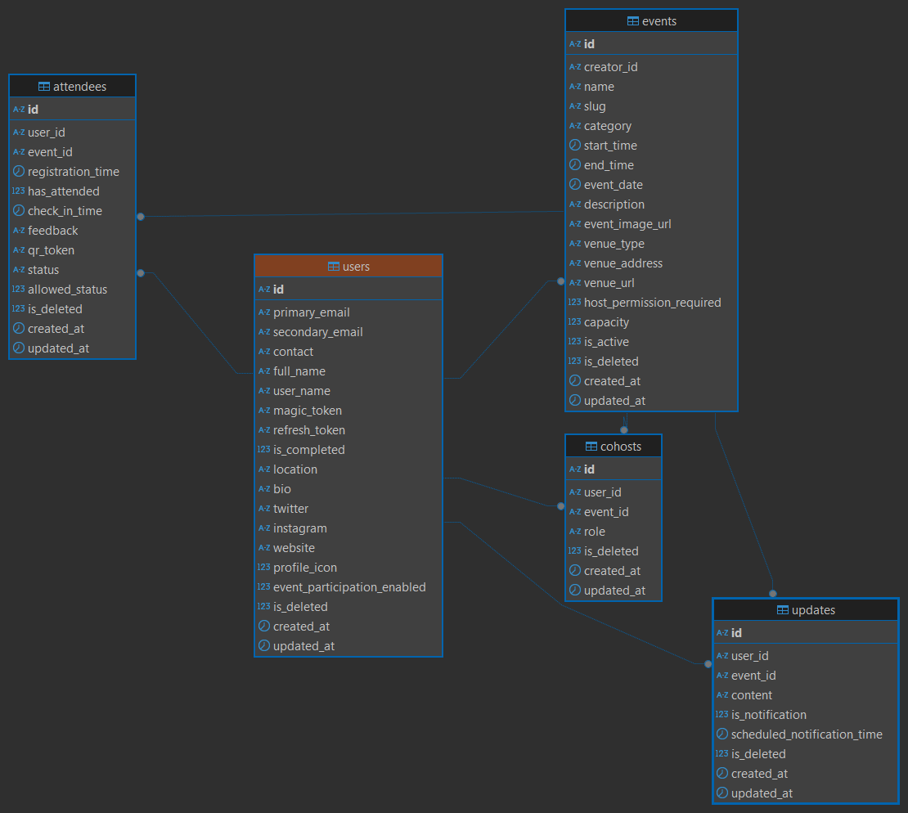

## Run the Project locally

```bash
git clone https://github.com/TeamShiksha/rsvp.git
cd rsvp
pnpm install
# Configure Environment Variables
pnpm  -F server migrate
pnpm -r dev
```

## Configure Environment Variables:

- Use the `.env_example` file as a reference to set up your environment variables.
- Rename it to `.env` and populate the required values.

## AWS setup

Developers should use the provided [CloudFormation template](../apps/server/aws/cft_dev_rsvp.yml) to create the necessary AWS resources. This template simplifies the setup process by provisioning and configuring the required infrastructure automatically. You will get the following environment from the setup:

- `AWS_ACCESS_KEY`
- `AWS_SECRET_KEY`
- `AWS_BUCKET_NAME`
- `AWS_REGION`

> [!CAUTION]
> Do not share these env with anyone.

## ER Diagram

The Physical Data Model/Entity-Relationship (ER) Diagram below provides a visual representation of the database schema. It illustrates the relationships between various entities, such as `users`, `events`, and more, along with their attributes and connections.

This diagram is a valuable tool for developers as it helps in understanding the structure of the database, the relationships between different entities, and the constraints applied. By referring to the ER Diagram, developers can design, query, and maintain the database more effectively, ensuring consistency and clarity in the application development process.



- `users`- Table contains user information.
- `events` - Table contains event information.
- `attendees` - Table contains event attendee information and ticket detail.
- `cohosts` - Table maps user to event to add cohost.
- `updates` - Table contains communication information for an event.

## UML Diagrams

TBC - put all the UML diagrams here

## Endpoints

TBC