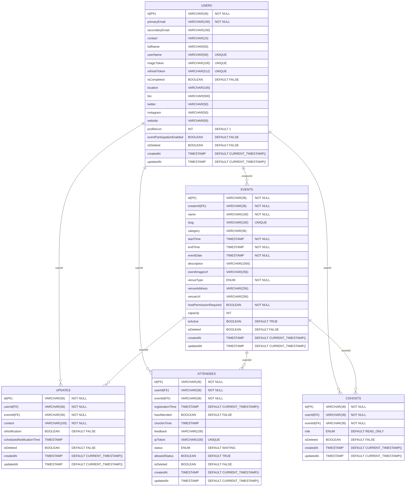

### Entity-Relationship Diagram

An Entity-Relationship diagram (ERD) is a conceptual, logical or physcial representation that shows Entities (objects or concepts), Relationships between entities, Attributes of entities, and Cardinality of relationships. ER diagrams are typically created early in the design process and focus on business concepts rather than implementation details. Diagram provided in the `Physical Data Model` section can be considered as the ER diagram.

### Detailed Explanation

  
<strong>USERS</strong> – Details about users

  <table>
    <thead>
      <tr>
        <th>Field</th>
        <th>Type</th>
        <th>Description</th>
      </tr>
    </thead>
    <tbody>
      <tr>
        <td>id</td>
        <td>uuid</td>
        <td>Primary key</td>
      </tr>
      <tr>
        <td>primary_email</td>
        <td>string</td>
        <td>User's primary email</td>
      </tr>
      <tr>
        <td>secondary_email</td>
        <td>string</td>
        <td>Optional secondary email</td>
      </tr>
      <tr>
        <td>contact</td>
        <td>string</td>
        <td>Phone number, optional</td>
      </tr>
      <tr>
        <td>full_name</td>
        <td>string</td>
        <td>Full name of the user</td>
      </tr>
      <tr>
        <td>user_name</td>
        <td>string</td>
        <td>Unique username</td>
      </tr>
      <tr>
        <td>magic_token</td>
        <td>string</td>
        <td>Optional login token</td>
      </tr>
      <tr>
        <td>refresh_token</td>
        <td>string</td>
        <td>Unique refresh token</td>
      </tr>
      <tr>
        <td>is_completed</td>
        <td>boolean</td>
        <td>Onboarding completed or not</td>
      </tr>
      <tr>
        <td>location</td>
        <td>string</td>
        <td>User's location</td>
      </tr>
      <tr>
        <td>bio</td>
        <td>string</td>
        <td>Profile bio</td>
      </tr>
      <tr>
        <td>twitter</td>
        <td>string</td>
        <td>Twitter handle</td>
      </tr>
      <tr>
        <td>instagram</td>
        <td>string</td>
        <td>Instagram handle</td>
      </tr>
      <tr>
        <td>website</td>
        <td>string</td>
        <td>Personal website</td>
      </tr>
      <tr>
        <td>profile_icon</td>
        <td>int</td>
        <td>Profile icon identifier</td>
      </tr>
      <tr>
        <td>event_participation_enabled</td>
        <td>boolean</td>
        <td>Can participate in events</td>
      </tr>
      <tr>
        <td>is_deleted</td>
        <td>boolean</td>
        <td>Soft delete flag</td>
      </tr>
      <tr>
        <td>created_at</td>
        <td>datetime</td>
        <td>Timestamp of creation</td>
      </tr>
      <tr>
        <td>updated_at</td>
        <td>datetime</td>
        <td>Timestamp of last update</td>
      </tr>
    </tbody>
  </table>

  
<strong>EVENT</strong> – Event metadata

  <table>
    <thead>
      <tr>
        <th>Field</th>
        <th>Type</th>
        <th>Description</th>
      </tr>
    </thead>
    <tbody>
      <tr>
        <td>id</td>
        <td>uuid</td>
        <td>Primary key</td>
      </tr>
      <tr>
        <td>creator_id</td>
        <td>uuid</td>
        <td>Foreign key to USERS</td>
      </tr>
      <tr>
        <td>name</td>
        <td>string</td>
        <td>Event name</td>
      </tr>
      <tr>
        <td>slug</td>
        <td>string</td>
        <td>Unique event identifier</td>
      </tr>
      <tr>
        <td>category</td>
        <td>string</td>
        <td>Optional category</td>
      </tr>
      <tr>
        <td>start_time</td>
        <td>datetime</td>
        <td>Start datetime</td>
      </tr>
      <tr>
        <td>end_time</td>
        <td>datetime</td>
        <td>End datetime</td>
      </tr>
      <tr>
        <td>event_date</td>
        <td>datetime</td>
        <td>Date of the event</td>
      </tr>
      <tr>
        <td>description</td>
        <td>string</td>
        <td>Detailed description</td>
      </tr>
      <tr>
        <td>event_image_url</td>
        <td>string</td>
        <td>Event image URL</td>
      </tr>
      <tr>
        <td>venue_type</td>
        <td>enum</td>
        <td>PHYSICAL | VIRTUAL | LATER</td>
      </tr>
      <tr>
        <td>venue_address</td>
        <td>string</td>
        <td>Address of venue</td>
      </tr>
      <tr>
        <td>venue_url</td>
        <td>string</td>
        <td>URL for online venue</td>
      </tr>
      <tr>
        <td>host_permission_required</td>
        <td>boolean</td>
        <td>Do co-hosts need approval</td>
      </tr>
      <tr>
        <td>capacity</td>
        <td>int</td>
        <td>Max attendees</td>
      </tr>
      <tr>
        <td>is_active</td>
        <td>boolean</td>
        <td>Event status</td>
      </tr>
      <tr>
        <td>is_deleted</td>
        <td>boolean</td>
        <td>Soft delete flag</td>
      </tr>
      <tr>
        <td>created_at</td>
        <td>datetime</td>
        <td>Timestamp of creation</td>
      </tr>
      <tr>
        <td>updated_at</td>
        <td>datetime</td>
        <td>Timestamp of last update</td>
      </tr>
    </tbody>
  </table>

  
<strong>UPDATE</strong> – Event updates

  <table>
    <thead>
      <tr>
        <th>Field</th>
        <th>Type</th>
        <th>Description</th>
      </tr>
    </thead>
    <tbody>
      <tr>
        <td>id</td>
        <td>uuid</td>
        <td>Primary key</td>
      </tr>
      <tr>
        <td>user_id</td>
        <td>uuid</td>
        <td>Foreign key to USERS</td>
      </tr>
      <tr>
        <td>event_id</td>
        <td>uuid</td>
        <td>Foreign key to EVENT</td>
      </tr>
      <tr>
        <td>content</td>
        <td>string</td>
        <td>Update message</td>
      </tr>
      <tr>
        <td>is_notification</td>
        <td>boolean</td>
        <td>Should notify?</td>
      </tr>
      <tr>
        <td>scheduled_notification_time</td>
        <td>datetime</td>
        <td>Optional scheduled send time</td>
      </tr>
      <tr>
        <td>is_deleted</td>
        <td>boolean</td>
        <td>Soft delete flag</td>
      </tr>
      <tr>
        <td>created_at</td>
        <td>datetime</td>
        <td>Timestamp of creation</td>
      </tr>
      <tr>
        <td>updated_at</td>
        <td>datetime</td>
        <td>Timestamp of last update</td>
      </tr>
    </tbody>
  </table>

  
<strong>ATTENDEE</strong> – Track attendees of events

  <table>
    <thead>
      <tr>
        <th>Field</th>
        <th>Type</th>
        <th>Description</th>
      </tr>
    </thead>
    <tbody>
      <tr>
        <td>id</td>
        <td>uuid</td>
        <td>Primary key</td>
      </tr>
      <tr>
        <td>user_id</td>
        <td>uuid</td>
        <td>Foreign key to USERS</td>
      </tr>
      <tr>
        <td>event_id</td>
        <td>uuid</td>
        <td>Foreign key to EVENT</td>
      </tr>
      <tr>
        <td>registration_time</td>
        <td>datetime</td>
        <td>When the user registered</td>
      </tr>
      <tr>
        <td>has_attended</td>
        <td>boolean</td>
        <td>Attendance status</td>
      </tr>
      <tr>
        <td>check_in_time</td>
        <td>datetime</td>
        <td>Check-in timestamp</td>
      </tr>
      <tr>
        <td>feedback</td>
        <td>string</td>
        <td>Optional feedback</td>
      </tr>
      <tr>
        <td>qr_token</td>
        <td>string</td>
        <td>Unique QR token</td>
      </tr>
      <tr>
        <td>status</td>
        <td>enum</td>
        <td>GOING | NOT_GOING | WAITING | PENDING | INVITED | CANCELLED</td>
      </tr>
      <tr>
        <td>allowed_status</td>
        <td>boolean</td>
        <td>Allowed into event</td>
      </tr>
      <tr>
        <td>is_deleted</td>
        <td>boolean</td>
        <td>Soft delete flag</td>
      </tr>
      <tr>
        <td>created_at</td>
        <td>datetime</td>
        <td>Timestamp of creation</td>
      </tr>
      <tr>
        <td>updated_at</td>
        <td>datetime</td>
        <td>Timestamp of last update</td>
      </tr>
    </tbody>
  </table>

  
<strong>COHOST</strong> – Event cohosts

  <table>
    <thead>
      <tr>
        <th>Field</th>
        <th>Type</th>
        <th>Description</th>
      </tr>
    </thead>
    <tbody>
      <tr>
        <td>id</td>
        <td>uuid</td>
        <td>Primary key</td>
      </tr>
      <tr>
        <td>user_id</td>
        <td>uuid</td>
        <td>Foreign key to USERS</td>
      </tr>
      <tr>
        <td>event_id</td>
        <td>uuid</td>
        <td>Foreign key to EVENT</td>
      </tr>
      <tr>
        <td>role</td>
        <td>enum</td>
        <td>CREATOR | MANAGER | READ_ONLY | CELEBRITY</td>
      </tr>
      <tr>
        <td>is_deleted</td>
        <td>boolean</td>
        <td>Soft delete flag</td>
      </tr>
      <tr>
        <td>created_at</td>
        <td>datetime</td>
        <td>Timestamp of creation</td>
      </tr>
      <tr>
        <td>updated_at</td>
        <td>datetime</td>
        <td>Timestamp of last update</td>
      </tr>
    </tbody>
  </table>

  
<strong>ENUMS</strong>

  <table>
    <thead>
      <tr>
        <th>Enum Name</th>
        <th>Values</th>
      </tr>
    </thead>
    <tbody>
      <tr>
        <td>STATUS</td>
        <td>GOING, NOT_GOING, WAITING, PENDING, INVITED, CANCELLED</td>
      </tr>
      <tr>
        <td>ROLE</td>
        <td>CREATOR, MANAGER, READ_ONLY, CELEBRITY</td>
      </tr>
      <tr>
        <td>VENUE_TYPE</td>
        <td>PHYSICAL, VIRTUAL, LATER</td>
      </tr>
    </tbody>
  </table>

