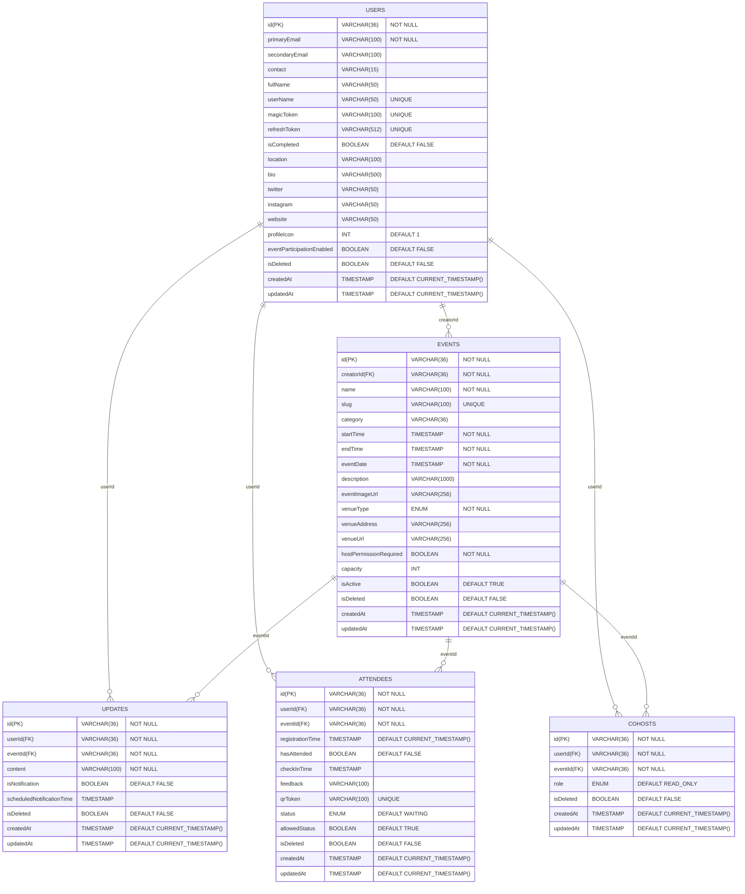

## Jump To

- [Architecture & System Design](#architecture-and-system-design)
- [API Design](#api-design)
- [Entity-Relationship Diagram](#entity-relationship-diagram)
- [Class UML Diagram](#orm-classes)
- [Endpoints](#endpoints)
- [Security and Authentication](#security-and-authentication)
- [Scalability & Performance](#scalability--performance)
- [Deployment Strategy](#deployment-strategy)
- [Failure Handling & Monitoring](#failure-handling--monitoring)
- [OAuth2 Flow](#oauth2-flow)

### Architecture and System Design

RSVP follows a **monorepo architecture** using **pnpm workspaces** to manage multiple applications in a single repository. This setup enables easier dependency management, code sharing, and streamlined development across the frontend, backend, and help center. The repository contains three main apps:

- **Web**: Frontend app built with React and Next.js.
- **Server**: Backend API built with Express and Node.js.
- **Help Center**: Static site built with Astro.

```bash
/
├── apps/
│ ├── web/ # Next.js frontend
│ ├── server/ # Express backend
│ └── help-center/ # Astro static site
├── docker/ # Docker configuration files
├── docs/ # Project documentation
├── package.json # Root workspace config
└── pnpm-workspace.yaml
```

#### Frontend

- **Framework:** Next.js (with `app/` directory for modern routing)
- **Validation:** Zod (schema validation), React Hook Form (form handling)
- **Data fetching:** React Query (server state and caching)
- **UI:** Shadcn + Radix UI components, styled with Tailwind CSS
- **Testing:** Vitest (with TypeScript support)
- **Why these?**  
  Next.js offers great SSR and static generation capabilities, enabling fast and SEO-friendly pages. Using TypeScript with strict type checking enhances code safety and maintainability. React Query efficiently handles API caching and synchronization with the backend.

#### Backend

- **Framework:** Express (Node.js)
- **Architecture pattern:** Separation into routes, controllers, repositories, and validation layers
- **Validation:** Zod for request body validation
- **Authentication:** Magic Links with JWT tokens for passwordless login
- **ORM & DB:** Prisma ORM with MySQL database
- **Logging:** Winston for centralized logging and error monitoring
- **Testing:** Supertest for API endpoint testing
- **Bundling:** Tsup for efficient TypeScript builds
- **Why these?**  
  Express is lightweight and flexible, allowing rapid API development in JavaScript, which aligns with the frontend language choice, enabling the team to work efficiently with a single language stack. Prisma offers type-safe database access, reducing runtime errors.

#### Help Center

- **Framework:** Astro for fast, static site generation
- **Why?** Astro allows building optimized, content-focused static sites, perfect for documentation or help resources with minimal runtime overhead.

#### Key System Design Decisions

- **Authentication:** Passwordless login via magic links improves user experience and security by avoiding passwords.
- **API Design:** RESTful APIs with versioning and proper HTTP methods for scalability and maintainability.
- **Error Handling:** Centralized error structure with consistent responses, logged via Winston.
- **Logging:** Winston manages logs for easier debugging and monitoring.
- **Type Safety:** Strict TypeScript usage reduces runtime bugs and improves developer productivity.
- **Testing:** Automated tests (Vitest on frontend, Supertest on backend) ensure reliability.

#### Security Considerations

- Passwordless authentication via magic links reduces risks related to password leaks.
- JWT tokens are securely signed and validated.
- All input is validated with Zod to prevent injection attacks.
- Sensitive environment variables are managed securely and not stored in code.
- Centralized logging helps identify suspicious activity.

## API Design

## Entity-Relationship Diagram

An Entity-Relationship diagram (ERD) is a conceptual, logical or physcial representation that shows Entities (objects or concepts), Relationships between entities, Attributes of entities, and Cardinality of relationships. ER diagrams are typically created early in the design process and focus on business concepts rather than implementation details. Diagram provided in the `Physical Data Model` section can be considered as the ER diagram.



### Detailed Explanation

<details>
  <summary><strong>USERS</strong> – Details about users</summary>
  <table>
    <thead>
      <tr>
        <th>Field</th>
        <th>Type</th>
        <th>Description</th>
      </tr>
    </thead>
    <tbody>
      <tr>
        <td>id</td>
        <td>uuid</td>
        <td>Primary key</td>
      </tr>
      <tr>
        <td>primary_email</td>
        <td>string</td>
        <td>User's primary email</td>
      </tr>
      <tr>
        <td>secondary_email</td>
        <td>string</td>
        <td>Optional secondary email</td>
      </tr>
      <tr>
        <td>contact</td>
        <td>string</td>
        <td>Phone number, optional</td>
      </tr>
      <tr>
        <td>full_name</td>
        <td>string</td>
        <td>Full name of the user</td>
      </tr>
      <tr>
        <td>user_name</td>
        <td>string</td>
        <td>Unique username</td>
      </tr>
      <tr>
        <td>magic_token</td>
        <td>string</td>
        <td>Optional login token</td>
      </tr>
      <tr>
        <td>refresh_token</td>
        <td>string</td>
        <td>Unique refresh token</td>
      </tr>
      <tr>
        <td>is_completed</td>
        <td>boolean</td>
        <td>Onboarding completed or not</td>
      </tr>
      <tr>
        <td>location</td>
        <td>string</td>
        <td>User's location</td>
      </tr>
      <tr>
        <td>bio</td>
        <td>string</td>
        <td>Profile bio</td>
      </tr>
      <tr>
        <td>twitter</td>
        <td>string</td>
        <td>Twitter handle</td>
      </tr>
      <tr>
        <td>instagram</td>
        <td>string</td>
        <td>Instagram handle</td>
      </tr>
      <tr>
        <td>website</td>
        <td>string</td>
        <td>Personal website</td>
      </tr>
      <tr>
        <td>profile_icon</td>
        <td>int</td>
        <td>Profile icon identifier</td>
      </tr>
      <tr>
        <td>event_participation_enabled</td>
        <td>boolean</td>
        <td>Can participate in events</td>
      </tr>
      <tr>
        <td>is_deleted</td>
        <td>boolean</td>
        <td>Soft delete flag</td>
      </tr>
      <tr>
        <td>created_at</td>
        <td>datetime</td>
        <td>Timestamp of creation</td>
      </tr>
      <tr>
        <td>updated_at</td>
        <td>datetime</td>
        <td>Timestamp of last update</td>
      </tr>
    </tbody>
  </table>
</details>
<details>
  <summary><strong>EVENT</strong> – Event metadata</summary>
  <table>
    <thead>
      <tr>
        <th>Field</th>
        <th>Type</th>
        <th>Description</th>
      </tr>
    </thead>
    <tbody>
      <tr>
        <td>id</td>
        <td>uuid</td>
        <td>Primary key</td>
      </tr>
      <tr>
        <td>creator_id</td>
        <td>uuid</td>
        <td>Foreign key to USERS</td>
      </tr>
      <tr>
        <td>name</td>
        <td>string</td>
        <td>Event name</td>
      </tr>
      <tr>
        <td>slug</td>
        <td>string</td>
        <td>Unique event identifier</td>
      </tr>
      <tr>
        <td>category</td>
        <td>string</td>
        <td>Optional category</td>
      </tr>
      <tr>
        <td>start_time</td>
        <td>datetime</td>
        <td>Start datetime</td>
      </tr>
      <tr>
        <td>end_time</td>
        <td>datetime</td>
        <td>End datetime</td>
      </tr>
      <tr>
        <td>event_date</td>
        <td>datetime</td>
        <td>Date of the event</td>
      </tr>
      <tr>
        <td>description</td>
        <td>string</td>
        <td>Detailed description</td>
      </tr>
      <tr>
        <td>event_image_url</td>
        <td>string</td>
        <td>Event image URL</td>
      </tr>
      <tr>
        <td>venue_type</td>
        <td>enum</td>
        <td>PHYSICAL | VIRTUAL | LATER</td>
      </tr>
      <tr>
        <td>venue_address</td>
        <td>string</td>
        <td>Address of venue</td>
      </tr>
      <tr>
        <td>venue_url</td>
        <td>string</td>
        <td>URL for online venue</td>
      </tr>
      <tr>
        <td>host_permission_required</td>
        <td>boolean</td>
        <td>Do co-hosts need approval</td>
      </tr>
      <tr>
        <td>capacity</td>
        <td>int</td>
        <td>Max attendees</td>
      </tr>
      <tr>
        <td>is_active</td>
        <td>boolean</td>
        <td>Event status</td>
      </tr>
      <tr>
        <td>is_deleted</td>
        <td>boolean</td>
        <td>Soft delete flag</td>
      </tr>
      <tr>
        <td>created_at</td>
        <td>datetime</td>
        <td>Timestamp of creation</td>
      </tr>
      <tr>
        <td>updated_at</td>
        <td>datetime</td>
        <td>Timestamp of last update</td>
      </tr>
    </tbody>
  </table>
</details>
<details>
  <summary><strong>UPDATE</strong> – Event updates</summary>
  <table>
    <thead>
      <tr>
        <th>Field</th>
        <th>Type</th>
        <th>Description</th>
      </tr>
    </thead>
    <tbody>
      <tr>
        <td>id</td>
        <td>uuid</td>
        <td>Primary key</td>
      </tr>
      <tr>
        <td>user_id</td>
        <td>uuid</td>
        <td>Foreign key to USERS</td>
      </tr>
      <tr>
        <td>event_id</td>
        <td>uuid</td>
        <td>Foreign key to EVENT</td>
      </tr>
      <tr>
        <td>content</td>
        <td>string</td>
        <td>Update message</td>
      </tr>
      <tr>
        <td>is_notification</td>
        <td>boolean</td>
        <td>Should notify?</td>
      </tr>
      <tr>
        <td>scheduled_notification_time</td>
        <td>datetime</td>
        <td>Optional scheduled send time</td>
      </tr>
      <tr>
        <td>is_deleted</td>
        <td>boolean</td>
        <td>Soft delete flag</td>
      </tr>
      <tr>
        <td>created_at</td>
        <td>datetime</td>
        <td>Timestamp of creation</td>
      </tr>
      <tr>
        <td>updated_at</td>
        <td>datetime</td>
        <td>Timestamp of last update</td>
      </tr>
    </tbody>
  </table>
</details>
<details>
  <summary><strong>ATTENDEE</strong> – Track attendees of events</summary>
  <table>
    <thead>
      <tr>
        <th>Field</th>
        <th>Type</th>
        <th>Description</th>
      </tr>
    </thead>
    <tbody>
      <tr>
        <td>id</td>
        <td>uuid</td>
        <td>Primary key</td>
      </tr>
      <tr>
        <td>user_id</td>
        <td>uuid</td>
        <td>Foreign key to USERS</td>
      </tr>
      <tr>
        <td>event_id</td>
        <td>uuid</td>
        <td>Foreign key to EVENT</td>
      </tr>
      <tr>
        <td>registration_time</td>
        <td>datetime</td>
        <td>When the user registered</td>
      </tr>
      <tr>
        <td>has_attended</td>
        <td>boolean</td>
        <td>Attendance status</td>
      </tr>
      <tr>
        <td>check_in_time</td>
        <td>datetime</td>
        <td>Check-in timestamp</td>
      </tr>
      <tr>
        <td>feedback</td>
        <td>string</td>
        <td>Optional feedback</td>
      </tr>
      <tr>
        <td>qr_token</td>
        <td>string</td>
        <td>Unique QR token</td>
      </tr>
      <tr>
        <td>status</td>
        <td>enum</td>
        <td>GOING | NOT_GOING | WAITING | PENDING | INVITED | CANCELLED</td>
      </tr>
      <tr>
        <td>allowed_status</td>
        <td>boolean</td>
        <td>Allowed into event</td>
      </tr>
      <tr>
        <td>is_deleted</td>
        <td>boolean</td>
        <td>Soft delete flag</td>
      </tr>
      <tr>
        <td>created_at</td>
        <td>datetime</td>
        <td>Timestamp of creation</td>
      </tr>
      <tr>
        <td>updated_at</td>
        <td>datetime</td>
        <td>Timestamp of last update</td>
      </tr>
    </tbody>
  </table>
</details>
<details>
  <summary><strong>COHOST</strong> – Event cohosts</summary>
  <table>
    <thead>
      <tr>
        <th>Field</th>
        <th>Type</th>
        <th>Description</th>
      </tr>
    </thead>
    <tbody>
      <tr>
        <td>id</td>
        <td>uuid</td>
        <td>Primary key</td>
      </tr>
      <tr>
        <td>user_id</td>
        <td>uuid</td>
        <td>Foreign key to USERS</td>
      </tr>
      <tr>
        <td>event_id</td>
        <td>uuid</td>
        <td>Foreign key to EVENT</td>
      </tr>
      <tr>
        <td>role</td>
        <td>enum</td>
        <td>CREATOR | MANAGER | READ_ONLY | CELEBRITY</td>
      </tr>
      <tr>
        <td>is_deleted</td>
        <td>boolean</td>
        <td>Soft delete flag</td>
      </tr>
      <tr>
        <td>created_at</td>
        <td>datetime</td>
        <td>Timestamp of creation</td>
      </tr>
      <tr>
        <td>updated_at</td>
        <td>datetime</td>
        <td>Timestamp of last update</td>
      </tr>
    </tbody>
  </table>
</details>
<details>
  <summary><strong>ENUMS</strong></summary>
  <table>
    <thead>
      <tr>
        <th>Enum Name</th>
        <th>Values</th>
      </tr>
    </thead>
    <tbody>
      <tr>
        <td>STATUS</td>
        <td>GOING, NOT_GOING, WAITING, PENDING, INVITED, CANCELLED</td>
      </tr>
      <tr>
        <td>ROLE</td>
        <td>CREATOR, MANAGER, READ_ONLY, CELEBRITY</td>
      </tr>
      <tr>
        <td>VENUE_TYPE</td>
        <td>PHYSICAL, VIRTUAL, LATER</td>
      </tr>
    </tbody>
  </table>
</details>


## Class UML Diagram

## Endpoints

## Security and Authentication

## Scalability & Performance

## Deployment Strategy

  - Frontend deployed on **Vercel** for seamless Next.js support and fast global delivery.
  - Backend deployed on **Railway**, a developer-friendly cloud platform.
  - CI/CD pipeline via **GitHub Actions** automates testing, linting, and deployment.

## Failure Handling & Monitoring

Failures are inevitable in production systems, but our setup ensures minimal user impact and fast recovery through structured error handling and real-time monitoring.

#### 🧱 Frontend & Backend Error Handling

- **React**: Error boundaries are implemented to prevent complete UI crashes, and retry logic is used for transient failures such as API issues. **(TODO)**
- **Express**: The backend uses **centralized error handling**, which standardizes error responses and improves log clarity across the app.

#### 📡 Monitoring & Observability

We use **Railway**’s native observability stack to track logs, metrics, and system health:

- Centralized **[Logs](https://docs.railway.com/guides/logs)** for debugging and traceability
- Live **[Metrics](https://docs.railway.com/guides/metrics)** dashboards for performance monitoring
- System-wide **[Observability](https://docs.railway.com/guides/observability)** for proactive issue detection
- Real-time alerts for downtime, high error rates, and slow endpoints **(TODO)**

Together, these tools allow us to monitor the system effectively and respond to issues quickly, even during peak usage.

## OAuth2 Flow
